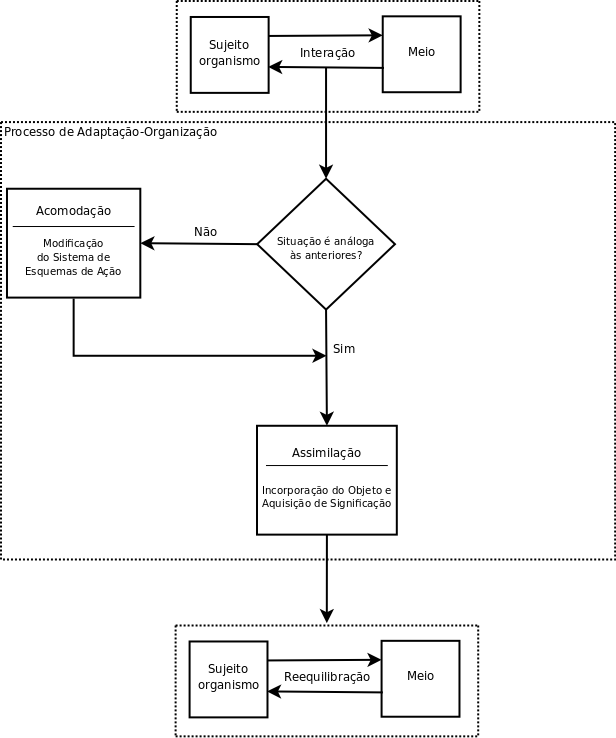

---
@title[Título]

@snap[midpoint headline span-80]
# Um estudo sobre a existência de invariantes funcionais na moral
@snapend

@snap[south-west byline text-black]
Vicente E. R. Marçal
@snapend

@snap[south-east byline text-black]
Patrícia U. R. Batáglia
@snapend

---
@title[Os Autores]

@snap[midpoint span-70]
@box[bg-gray text-white rounded box-font-size](Vicente Eduardo Ribeiro Marçal#Doutorando em Psicologia Social pelo IP-USP Professor Adjunto do Departamento de Filosofia da UNIR Coordenador do GEPEGRA) 
@snapend

+++
@snap[midpoint span-70]
@box[bg-gray text-white rounded box-font-size](Patrícia Unger Raphael Batáglia#Doutora em Psicologia social pelo IP-USP Professora Associada do Departamento de Psicologia da Educação da UNSPE-Marília) 
@snapend

---
@title[Introdução]

@snap[north-east]
   
Introdução
@snapend

@snap[south-west list-content-concise span-100 box-font-size]
@ul
- O Trabalho de Piaget é seminal em muitos aspectos
- Certamente a temática a que mais se debruçou foi a Epistemologia
- Mas a moral lhe foi um tema caro, ao qual dedicou um livro extremamente importante
- Contudo, o projeto ficou incacabado (ver Lia Freitas)
- Abrindo muitas possibilidades de trabalho, como a que apresentamos aqui
@ulend
  
@snapend

---
@title[Invariantes Funcionais no Desenvolvimento Cogntivo]

@snap[west text-balck box-font-size]
Invariantes Funcionais no Desenvolvimento Cogntivo
@snapend

@snap[east image-size]

@snapend

---
@title[Desenvolvimento Moral - I]

@snap[north-east]
   
Desenvolvimento Moral - Parte I
@snapend

@snap[south-west list-content-concise span-100 box-font-size]
@ul
- _Recherche_ de 1919 Piaget já sinalizava para uma inteção sobre a moral
- 1932 escreve _Le Jugement Moral chez l'Enfant_ obra fruto de sua pesquisa sobre o tema
- Contudo compreendemos ter um caráter periférico, justamente por ser única
- Como já dissemos é um projeto ficou incacabado (ver Lia Freitas)
- Piaget compreende ser a moral um sistema de regras
@ulend
  
@snapend

---
@title[Desenvolvimento Moral - II]

@snap[north-east]
   
Desenvolvimento Moral - Parte II
@snapend

@snap[south-west list-content-concise span-100 box-font-size]
@ul
- Sendo assim, não é Piaget que leva a cabo a pesquisa sobre a Moral
- Temos grandes pesquisadores que tratam da temática
- No Brasil destacamos Yves de La Taille e Lia Freitas
- Nosso trabalho, também, discute com as contribuições de Kohlberg sobre a temática
- Constatamos, principalmente, que o invariante funcional seria a relação com regras que vai da anomia à autonomia.
@ulend
  
@snapend

---
@snap[midpoint]
# Obrigado
@snapend

